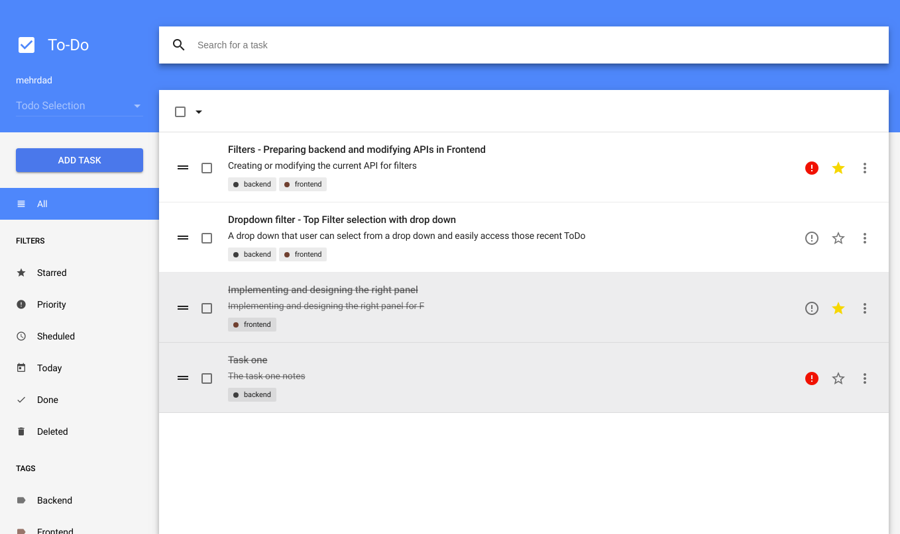

# TinyTasks

Welcome to _TinyTasks_, the most basic task management app in the whole wide world - no fancy UI and a
very limited set of features. Fortunately, you are here to save the day and improve parts of _TinyTasks_.
Feel free to focus on a single feature or aspect of the application. You can find a list of open issues in
the [issue section](https://github.com/mindsmash/tiny-tasks/issues) of this repository.

## Demo 

## Development

The application consists of a frontend and a backend. Both can be started separately. The frontend is
[Angular](https://angular.io/) based and the backend is based on [Spring Boot](https://spring.io/projects/spring-boot).

Before you can start developing you need to set up your development environment. You can find good and clear
instructions on the Angular website in the [Quickstart](https://angular.io/guide/quickstart) guide. The
backend requires a [PostgreSQL](https://www.postgresql.org/) database server that is provided by a
[Docker](https://www.docker.com/) container. Thus, Docker is required. You can find the information you need to
set up the runtime environment on the Docker website under [Get Started](https://www.docker.com/get-started).

### Frontend

The fronted was generated with [Angular CLI](https://github.com/angular/angular-cli). Run `yarn` to install the
dependencies for the app. You can also add new dependencies via `yarn add`. Run `yarn start` for a dev server.
Navigate to `http://localhost:4200/`. The app will automatically reload if you change any of the source files.

To run the dev server without starting the backend use `yarn start-local`. The application will then store its
data in the browser's local storage instead of sending the data to the backend.

Run `yarn lint` to lint your application and `yarn test` to execute the unit tests via [Karma](https://karma-runner.github.io).

### Backend

The backend was generated with [Spring Initializr](https://start.spring.io/). Run `docker-compose up -d` to launch
the PostgreSQL docker container. Run `./gradlew bootRun` for a dev server. The server is available under `http://localhost:8080/`.

Run `./gradlew test` to execute the tests.

## Let's go

As you can see, there's a lot to do. Just pick one of the [issues](https://github.com/mindsmash/tiny-tasks/issues) and
start coding. Also, do not hesitate to contact us if you run into any problems. We are here to help.

You can simply fork this repository and start working on _TinyTasks_. Please create a pull request after finishing your work.
